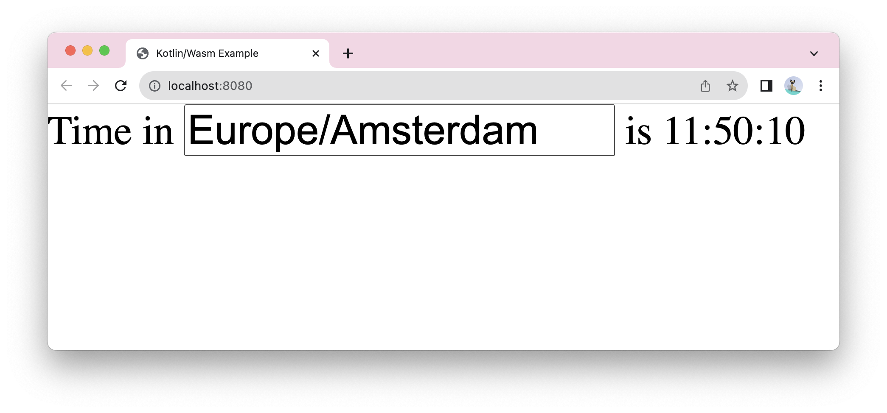

# Kotlin/Wasm browser example

This example showcases a Kotlin/Wasm app. The application shows "Hello World" in the browser using DOM API.

Check it out:

.

Follow the instructions in the sections below to try out this Kotlin/Wasm application.

## Set up the environment

Before starting, ensure you have the necessary IDE and browser setup to run the application.

### IDE

We recommend using [IntelliJ IDEA 2023.1 or later](https://www.jetbrains.com/idea/) to work with the project.
It supports Kotlin/Wasm out of the box.

### Browser (for Kotlin/Wasm target)

To run Kotlin/Wasm applications in a browser, you need a browser supporting the [Wasm Garbage Collection (GC) feature](https://github.com/WebAssembly/gc):

**Chrome and Chromium-based**

* **For version 119 or later:**

  Works by default.

**Firefox**

* **For version 120 or later:**

  Works by default.

**Safari/WebKit**

Wasm GC support is currently under
[active development](https://bugs.webkit.org/show_bug.cgi?id=247394).

> **Note:**
> For more information about the browser versions, see the [Troubleshooting documentation](https://kotl.in/wasm_help/).

## Build and run

To build and run the application:

1. In IntelliJ IDEA, open the repository.
2. Navigate to the `browser-example` project folder.
3. Run the application by typing the following Gradle command in the terminal:

   `./gradlew wasmJsBrowserRun -t`
    &nbsp; 

Once the application starts, open the following URL in your browser:

`http://localhost:8080`

> **Note:**
> The port number can vary. If the port 8080 is unavailable, you can find the corresponding port number printed in the console
> after building the application.

## Feedback and questions

Give it a try and share your feedback or questions in our [#webassembly](https://slack-chats.kotlinlang.org/c/webassembly) Slack channel.
[Get a Slack invite](https://surveys.jetbrains.com/s3/kotlin-slack-sign-up).
You can also share your comments with [@bashorov](https://twitter.com/bashorov) on X (Twitter).

## Learn more

* [Kotlin/Wasm](https://kotl.in/wasm/)
* [Other Kotlin/Wasm examples](https://github.com/Kotlin/kotlin-wasm-examples/tree/main)
