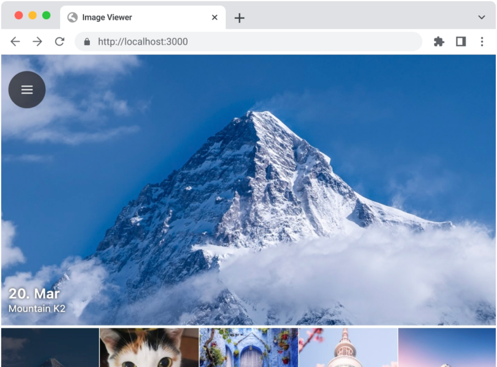

# Compose for Web

> Web support in Compose Multiplatform is Experimental and may be changed at any time. Use it only for evaluation purposes.
> We would appreciate your feedback on it in the public Slack channel [#compose-web](https://slack-chats.kotlinlang.org/c/compose-web).
> If you face any issues, please report them on [GitHub](https://github.com/JetBrains/compose-multiplatform/issues).

You can experiment with sharing your mobile or desktop UIs with the web. Compose for Web is based on [Kotlin/Wasm](https://kotl.in/wasm),
the newest target for Kotlin Multiplatform projects. It allows Kotlin developers to run their code in the browser with
all the benefits that WebAssembly has to offer, such as good and predictable performance for your applications.

Learn more about [Compose Multiplatform](https://github.com/JetBrains/compose-multiplatform/#compose-multiplatform).

# Image Viewer

Web version of an image gallery for remote server image viewing built with Compose Multiplatform.

## Build and run

### Run on Web version via Gradle

`./gradlew :shared:wasmRun`

### Run on Desktop version via Gradle

`./gradlew :desktopApp:run`

### Running Android application

`./gradlew :androidApp:installDebug`

# Feedback & Questions

Give it a try, and share your feedback and ask questions in the Kotlin Slack [#compose-web](https://slack-chats.kotlinlang.org/c/compose-web) channel (if you’re not a member, [apply here](https://kotl.in/slack)) or in the twitter [@bashorov](https://twitter.com/bashorov).

# Learn more

* [Kotlin/Wasm](https://kotl.in/wasm/)
* [Other examples](../#Examples)
