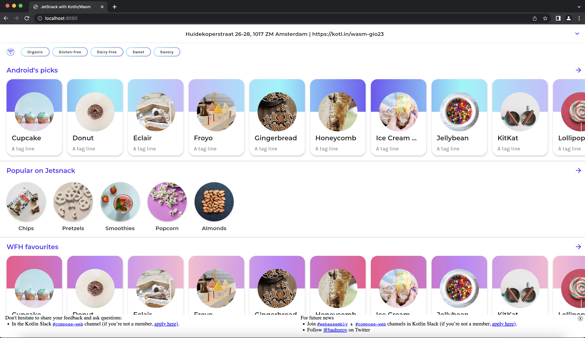

# Jetsnack

Web version of [Jetsnack application](https://github.com/android/compose-samples/tree/main/Jetsnack) built with [Compose Multiplatform for Web](#compose-multiplatform-for-web) and [Kotlin/Wasm](#kotlinwasm).

> To learn more about the Jetsnack application, visit the [README.md of the original project](https://github.com/android/compose-samples/tree/main/Jetsnack).

## Kotlin/Wasm

> **Note**
> Kotlin/Wasm is Experimental and may be changed at any time. Use it only for evaluation purposes.
> We would appreciate your feedback on it in the public Slack channel [#webassembly](https://slack-chats.kotlinlang.org/c/webassembly).
> If you face any issues, please report them on [YouTrack](https://youtrack.jetbrains.com/issue/KT-56492).

Kotlin/Wasm is a new experimental target that enables developers to compile Kotlin code to WebAssembly (Wasm).
It is designed to offer faster compilation speeds, improved interoperability with JavaScript, and better integration with browsers.
Wasm's compact and easy-to-parse bytecode potentially leads to faster application startup times, and its statically typed nature can improve application runtime performance.

## Compose Multiplatform for Web

> **Note**
> Web support is Experimental and may be changed at any time. Use it only for evaluation purposes.
> We would appreciate your feedback on it in the public Slack channel [#compose-web](https://slack-chats.kotlinlang.org/c/compose-web).
> If you face any issues, please report them on [GitHub](https://github.com/JetBrains/compose-multiplatform/issues).

Compose for Web is based on [Kotlin/Wasm](https://kotl.in/wasm), the newest target for Kotlin Multiplatform projects.
It allows you to run your code in the browser with all the benefits that WebAssembly has to offer, such as good and predictable performance for your applications.

## Setup environment

### IDE

We recommend using [IntelliJ IDEA 2023.1 or later](https://www.jetbrains.com/idea/) to work with the project.
It has Kotlin/Wasm support out of the box.

### Browser

Almost all modern browsers already support WebAssembly 1.0.

To set up the environment to run WebAssembly, you only need to enable an experimental [garbage collection feature](https://github.com/WebAssembly/gc):

**Chrome**:

* For version 109:

  Run the application with the `--js-flags=--experimental-wasm-gc` command line argument.

* For version 110 or later:

  1. Go to `chrome://flags/#enable-webassembly-garbage-collection` in your browser.
  2. Enable **WebAssembly Garbage Collection**.
  3. Relaunch your browser.

**Firefox Nightly**:

For version 112 or later:

1. Go to `about:config` in your browser.
2. Enable `javascript.options.wasm_function_references` and `javascript.options.wasm_gc` options.
3. Relaunch your browser.

**Edge**:

For version 109 or later:

Run the application with the `--js-flags=--experimental-wasm-gc` command line argument.

For more information see https://kotl.in/wasm_help/.

## Build and run

Check out the repository, navigate to the project folder, and use the following commands:

### Run Web version via Gradle

Run the following Gradle command in the terminal: `./gradlew :web:wasmRun`

Once the application starts, open the following URL in your browser: `http://localhost:8080`

### Run Desktop version via Gradle

Run the following Gradle command in the terminal: `./gradlew :desktop:run`

### Install Android application via Gradle

Run the following Gradle command in the terminal: `./gradlew :android:installDebug`

# Feedback & questions

Give it a try, and share your feedback and ask questions in the Kotlin Slack [#compose-web](https://slack-chats.kotlinlang.org/c/compose-web) channel (if you’re not a member, [apply here](https://kotl.in/slack)) or on Twitter to [@bashorov](https://twitter.com/bashorov).

# Learn more

* [Compose Multiplatform](https://github.com/JetBrains/compose-multiplatform/#compose-multiplatform)
* [Kotlin/Wasm](https://kotl.in/wasm/)
* [Other examples](../../../#examples)
