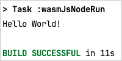

# Kotlin/Wasm Node.js example

This example shows a simple application printing "Hello World" in Node.js.

> **Note:**
> This application uses a nightly version of Node.js 20.

In the next sections, you can find information to try out this application built with Kotlin/Wasm.

## Set up the environment

Before you start, prepare the IDE you require to run the application.

### IDE

We recommend using [IntelliJ IDEA 2023.1 or later](https://www.jetbrains.com/idea/) to work with the project.
It supports Kotlin/Wasm out of the box.

## Build and run

To build and run the application:

1. In IntelliJ IDEA, open the repository.
2. Navigate to the `nodejs-example` project folder.
3. Run the application by using the following Gradle command:

`./gradlew wasmJsNodeRun`

## Feedback and questions

Give it a try and share your feedback or questions in our [#webassembly](https://slack-chats.kotlinlang.org/c/webassembly) Slack channel.
[Get a Slack invite](https://surveys.jetbrains.com/s3/kotlin-slack-sign-up).
You can also share your comments with [@bashorov](https://twitter.com/bashorov) on X (Twitter).

## Learn more

* [Kotlin/Wasm](https://kotl.in/wasm/)
* [Other Kotlin/Wasm examples](https://github.com/Kotlin/kotlin-wasm-examples/tree/main)