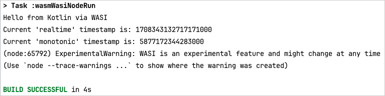

# Kotlin/Wasm WASI example

This example showcases a simple application using WASI API in Node.js and Deno.

> **Note:**
> This example uses a version of 21.0.0-v8-canary.

Follow the instructions in the sections below to try out this Kotlin/Wasm application.

## Set up the environment

Before starting, ensure you have the necessary IDE setup to run the application.

### IDE

We recommend using [IntelliJ IDEA 2023.1 or later](https://www.jetbrains.com/idea/) to work with the project.
It supports Kotlin/Wasm out of the box.

## Build and run

To build and run the application:

1. In IntelliJ IDEA, open the repository.
2. Navigate to the `wasi-example` project folder.
3. Run the application by typing one of the following Gradle commands in the terminal:

* **Run the program with NodeJs:**

  `./gradlew wasmWasiNodeRun` 
   &nbsp; 

* **Run tests with NodeJs:**

  `./gradlew wasmWasiNodeTest`
   &nbsp; 

* **Run the program with Deno:**

  `./gradlew wasmWasiDenoRun`
   &nbsp; 

* **Run tests with Deno:**

  `./gradlew wasmWasiDenoTest`

  > **Note:**
  > For Windows platform, ensure `deno.exe` is installed. For more information, 
  > see [Deno's installation documentation](https://docs.deno.com/runtime/manual/getting_started/installation).

## Feedback and questions

Give it a try and share your feedback or questions in our [#webassembly](https://slack-chats.kotlinlang.org/c/webassembly) 
Slack channel. [Get a Slack invite](https://surveys.jetbrains.com/s3/kotlin-slack-sign-up).
You can also share your comments with [@bashorov](https://twitter.com/bashorov) on X (Twitter).

## Learn more

* [Kotlin/Wasm](https://kotl.in/wasm/)
* [Other Kotlin/Wasm examples](https://github.com/Kotlin/kotlin-wasm-examples/tree/main)